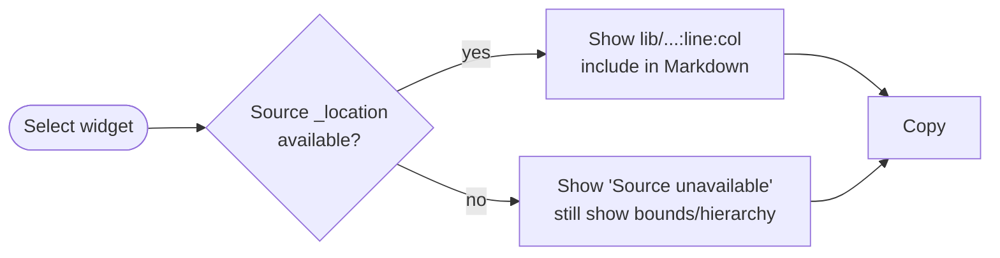
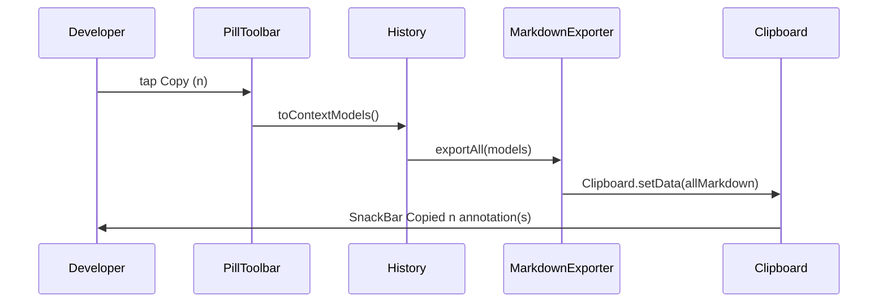
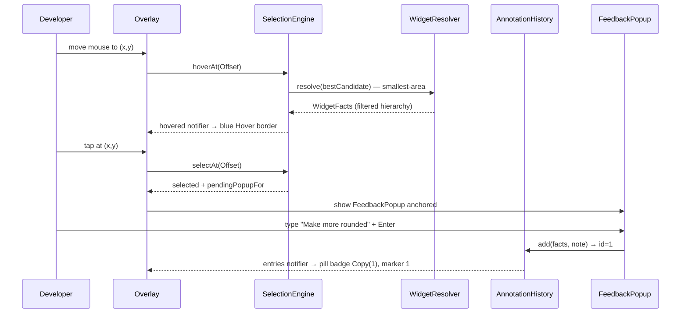
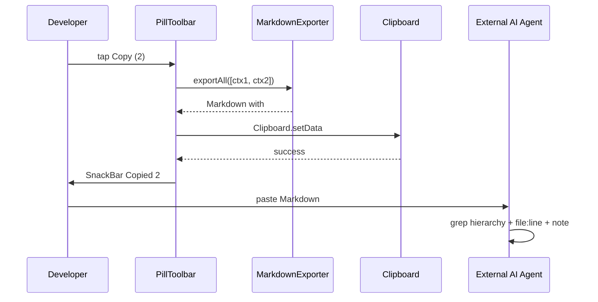

# Flow — Function Call Map & User Flows (Flutter Agentation)

> **Purpose**: The "how it works" file — which functions/widgets call what, user journeys, request/response sequences (inspection → Markdown), screens. **Update whenever** you add/rename/remove a module, widget, controller, service, repository, route, or pipeline step. A stale diagram is worse than no diagram.

---

## Overview

Flutter Agentation is a **local, on-device inspector** embedded in a Flutter app via `MaterialApp(builder: AgentationOverlay)`. Entry is a **40dp black circle with white logo + badge** at bottom-right (like Next.js `agentation.com` circle), which **morphs to a black pill toolbar** (`Copy(n)/Clear/Pause/Visibility/History`) on tap. While inspecting, **hover** (desktop/web `MouseRegion`) shows a **blue/indigo 1.5px border + name badge** for the smallest-area `RenderBox` under cursor, so background vs `Card` vs `Button` is instantly distinguishable. **Click** shows only a **black popup `Say what to change…` input + Add/Cancel** anchored to the selection rect — full `Widget/Source/Geometry/Hierarchy` is only in the **copied Markdown**. Multiple annotations form a **history list** (reindex 1..n, delete per row, `Copy all`).

Core loop (V1+R10): **Circle → Pill → Hover (blue) → Select → Popup (black input) → Add to History → Copy All → External Agent** — `spec.md:16-33` + `Feature_docs/R10-circle-hover-history/spec.md:1`.

---

## Architecture Diagram (pipeline — R10)

```mermaid
graph TD
    subgraph App["Flutter App (host) — MaterialApp(builder: AgentationOverlay)"]
        UI[App UI]
        Trigger[Circle 40dp black/white badge]
        Pill[Pill black/white Copy/Clear/Pause/Visibility/History]
        Hover[Hover border blue]
        Sel[Selected highlight primary]
        Popup[FeedbackPopup black input]
        History[History sheet black]
    end
    subgraph Pipeline["Agenation Pipeline"]
        SE[SelectionEngine<br/>smallest-area + _isLeafText lift]
        HE[HoverEngine<br/>hoverAt() → hovered notifier]
        WR[WidgetResolver<br/>_location → lib/ normalize + hierarchy filter]
        HM[AnnotationHistory<br/>add/remove/clear reindex]
        EX[MarkdownExporter<br/>export / exportAll]
        CB[Clipboard]
    end
    subgraph External["Outside"]
        DEV[External AI Agent]
        VCS[(Git)]
    end
    UI --> Trigger --> Pill
    Pill --> SE
    SE --> WR
    WR --> HM
    HM --> EX --> CB --> DEV
    HE -.-> Hover
    SE -.-> Sel
    SE -.-> Popup
    Pill -.-> History
    DEV --> VCS
    classDef v2 fill:#111,stroke:#fff,color:#fff
    class Trigger,Pill,Popup,History v2
```

Dependency: `Overlay (Circle/Pill/Hover/Popup) → SelectionEngine (selectAt/hoverAt) → WidgetResolver → AnnotationHistory → MarkdownExporter` → single `ContextModel` (`facts` vs `intent` vs `visual` stub).

---

## User Flows

### Flow: Circle → Pill (entry)

```mermaid
flowchart LR
    A([App start]) --> B[Circle 40dp black/white bottom-right]
    B --> C{Tapped?}
    C -- yes --> D[Pill expands 40→240 220ms<br/>Copy(0) Clear Pause Visibility History]
    C -- drag --> E[Drag circle, auto-dock 12px peek]
    D --> F[Inspect enabled]
    F --> G[Hover shows blue border]
```

Like `agentation.com` bottom-right circle → toolbar, and `zero_inspector_kit` auto-dock peek. `PillToolbar` is `Colors.black` with `Colors.white` icons for contrast (ADR-017).

### Flow: Hover to Identify (desktop/web)

```mermaid
flowchart LR
    A([Inspect on]) --> B[Mouse moves]
    B --> C{Smallest-area RenderBox<br/>containing offset?}
    C -- yes --> D[Hover border blue #3B82F6 1.5px<br/>badge widgetType]
    C -- no --> E[Clear hover]
    D --> F{Move to Button<br/>inside Card?}
    F -- Card 200×200 vs Button 120×60 --> G[Button wins (smaller area)]
    F -- Text leaf 80×20 inside Button --> H[Lift to Button ancestor]
```

`lib/src/selection/selection_engine.dart:9` `hoverAt()` + `MouseRegion.onHover` (`agentation_overlay.dart:106`), not `Listener.onPointerDown` only. Filter `_` private, choose smallest `width*height`.

### Flow: Select → Minimal Popup (not full panel)

```mermaid
flowchart LR
    A([Hovering Button]) --> B[Click]
    B --> C[SelectionHighlight solid primary]
    C --> D[FeedbackPopup black<br/>300×120 anchored to rect<br/>Say what to change… + Add/Cancel]
    D --> E{Enter or Add?}
    E -- text entered --> F[Add → history entry 1<br/>marker 1 on widget<br/>popup closes]
    E -- Cancel --> G[Clear pending, no history]
    F --> H[Copy (1) badge updates]
```

Only input is shown on click; hierarchy/source only in Markdown (`Feature_docs/R10` FR-004). Popup flips above selection if near bottom edge (`_popupTop`).

### Flow: History Multi + Delete

```mermaid
flowchart LR
    A([2 annotations]) --> B[Taps History in pill]
    B --> C[Bottom sheet black<br/>1 ElevatedButton: Make rounded<br/>2 Card: more padding]
    C --> D{Delete 1?}
    D -- yes --> E[Reindex: 2→1, marker 1 removed]
    D -- Clear --> F[History empty, Copy(0) disabled]
    E --> G[Copy (1) → Markdown with ## Annotation 1 only]
```

`lib/src/annotation/annotation_history.dart:1` `ValueNotifier<List<AnnotationEntry>>` `add/remove/clear` reindex, `MarkdownExporter.exportAll()` writes `## Annotation n` per entry.

### Flow: Source unavailable (graceful)



`lib/src/resolver/source_resolver.dart:17` reads `Element._location` via dynamic + normalizes `file://` → `lib/` to avoid absolute leak (ADR-016).

### Flow: Copy All



---

## Request / Response Flows

### 1. Hover → Select → Popup → History



### 2. Copy → External agent



---

## Function Call Map

```text
lib/agentation.dart (barrel)
 └─ AgentationOverlay.wrap(child: MaterialApp.builder → child)  [example/lib/main.dart:11]
      ├─ CircleToggle 40dp black/white badge (lib/src/overlay/circle_toggle.dart:1) — collapsed
      │    └─ onTap → AgentationController.expand() + enable()
      ├─ PillToolbar black/white (lib/src/overlay/pill_toolbar.dart:1) — expanded
      │    ├─ Copy (n) → controller.exportAll() → MarkdownExporter.exportAll()
      │    ├─ Clear → history.clear()
      │    ├─ Pause/Visibility → isPaused/isVisible toggles (hover/selection gate)
      │    ├─ History → showModalBottomSheet black sheet
      │    └─ Close → collapse() + disable()
      ├─ AgentationController (lib/src/overlay/agentation_controller.dart:11)
      │    ├─ isEnabled / isExpanded / isPaused / isVisible (ValueNotifier<bool>)
      │    ├─ selected / hovered / pendingPopupFor (ValueNotifier<SelectionResult?>)
      │    ├─ history: AnnotationHistory (add/remove/clear reindex)
      │    ├─ selectAt(Offset) → SelectionEngine.selectAt → pendingPopupFor
      │    ├─ onHover(Offset) → SelectionEngine.hoverAt → hovered (blue border)
      │    └─ currentContext / exportAll()
      ├─ SelectionEngine (lib/src/selection/selection_engine.dart:9)
      │    ├─ hoverAt(Offset) → _bestCandidate(smallest-area) → hovered
      │    ├─ selectAt(Offset) → _bestCandidate → selected + _isLeafText lift
      │    └─ WidgetResolver.resolve(element) (lib/src/resolver/widget_resolver.dart:1)
      │         ├─ SourceResolver.location → _location → lib/ normalize
      │         ├─ BoundsExtractor.rect → RenderBox.localToGlobal
      │         ├─ HierarchyExtractor.path → filter _ + noisy, cap 20
      │         ├─ TextExtractor.text → Text.data / textSpan.toPlainText
      │         └─ KeyResolver.keyOf → widget.key.toString()
      ├─ FeedbackPopup 300×120 black (lib/src/annotation/feedback_popup.dart:1)
      │    └─ TextField (white on black, onSubmitted → history.add)
      ├─ HoverHighlight (blue #3B82F6 1.5px + badge) — agentation_overlay.dart:117
      ├─ SelectionHighlight (primary solid) — lib/src/overlay/selection_highlight.dart:1
      └─ HistorySheet (black ListView) — agentation_overlay.dart:45
```

### Example pipeline

```text
Hover at Button center (120×60) inside Card 200×200
 → candidates: Card 40000, Button InkWell 7200, Text 1600 → non-Text smallest is InkWell 7200 → best = InkWell
 → lift check: best is not Text, so keep InkWell → resolve → WidgetFacts(hierarchy filtered to Scaffold→Card→ElevatedButton)
 → hovered border blue at InkWell rect

Tap → selected = ElevatedButton element (lifted from Text leaf) → pendingPopupFor → FeedbackPopup
→ type "Make more rounded" + Enter → history.add(facts, note) → id 1
→ Copy (1) → exportAll([ctx1]) → Markdown with ## Annotation 1 → Clipboard
```

---

## Route / Screen Map — Overlay Chrome (black theme ADR-017)

| Chrome | Location | Purpose | Color | When visible |
|--------|----------|---------|-------|--------------|
| CircleToggle | bottom-right 24,24 SafeArea, draggable 40dp | Entry, shows count badge | `Colors.black` bg, `Colors.white` icon | Always when collapsed |
| PillToolbar | bottom-right 24,24 SafeArea, fixed (not draggable) | Copy(n)/Clear/Pause/Visibility/History/Close | `Colors.black` bg, `Colors.white` icons/text | When `isExpanded` |
| Hover border | `Positioned` at `hovered.bounds` | Blue #3B82F6 1.5px + badge indigo | `Color(0xFF3B82F6)` 0.6 border, 0.06 fill, white badge | `isEnabled && isVisible && !isPaused && hovered != null` |
| Selected highlight | same Positioned | Solid primary border | `colorScheme.primary` 1.5px | `selected != null` |
| FeedbackPopup | `Positioned` left `x+w+12` or flipped, top `y` | Black input `Say what…` + Add/Cancel, `Enter` creates | `Colors.black` surface, white 70 hint, white border | `pendingPopupFor != null` |
| History sheet | `showModalBottomSheet` black | List `id • widgetType • note` + delete per row | `Colors.black` bg, white text, white 24 divider | On History tap |

No app routes added; overlay is via `MaterialApp.builder`.

### Pill Layout — Current vs Desired (ASCII — why pill distorts)

**Current (bottom-right monolithic pill, flat Row, pure black #000, no blur, 390dp > 320dp overflow):**
```
Viewport 390 x 844
┌─────────────────────────────────────────┐
│  App Card 200x200                      │
│   ┌────────────────────┐               │
│   │  ElevatedButton ◄─┼─ hover blue   │  ← highlight under pill hidden
│   └────────────────────┘  #3B82F6 1.5 │
│                                         │
│                     ┌───────────────────────────────────────┐ RIGHT+24 BOTTOM+24
│                     │ ◉  Copy(2) Clear │ ⏸ 👁 ⧉(2) ✕  │◄─ Single Row, divider 1px
│                     └───────────────────────────────────────┘   radius 28, 0xCC0A0A0A, scroll
│                     └─ SingleChildScrollView overflow on 320dp  no blur, 36dp targets
└─────────────────────────────────────────┘
```
*Evidence:* `lib/src/overlay/pill_toolbar.dart:36` Row 390dp, `lib/src/overlay/agentation_overlay.dart:222` `Positioned(right:24,bottom:24)` loose constraints, `withOpacity(0.08)` hard.

**Desired (bottom-center grouped glass, charcoal, 8px grid, stagger — premium Modern Minimalist):**
```
Viewport 390 x 844
┌─────────────────────────────────────────┐
│  App — no occlusion                    │
│   ┌────────────────────┐               │
│   │  ElevatedButton ◄─┼─ hover blue   │  ← always visible above toolbar
│   └────────────────────┘               │
│           ┌── Centered bottom ── 16 ──┐ │  ← Align(bottomCenter) + SafeArea
│           │  Backdrop blur 16 + 0.72  │ │     ConstrainedBox max 560, gap 8/16
│           │ ┌─────┐ ┌──────────────┐ ┌─┴─┐ ┌─────────────────┐ ┌─────┐│
│           │ │ ⋮⋮ ◉│ │ Copy(2) ●  │ │ ⏸ │ │ 👁  ⧉  │ │▭ L │ │ ✕ ││
│           │ │ drag│ │ primary CTA │ │   │ │ toggle group │ │Layout│ │close││
│           │ └─────┘ └──────────────┘ └─┬─┘ └─────────────────┘ └─────┘│
│           └──────────┴────────┴───────┴─────┴───────────────────────┘│
│                Group A   Group B     Group C     Group D         E  │   blur lets content shine
└─────────────────────────────────────────┘  shadow-lg 0 8px 32px rgba(0,0,0,.12) + border 0.08
```
`lib/src/overlay/tokens.dart:17` `charcoal #0A0A0A` + `cream #F5F0EB` + `indigo #6366F1`, `shadowSm/Md`, `micro 150ms easeStandard cubic(0.4,0,0.2,1)`, `AnimatedSwitcher` 220ms morph `40→240` + stagger `40ms*i`, `44×44` touch targets.

---

## Visual Tool — Missing (vs Next.js Agentation)

| Next.js Feature | Flutter Gap | File |
|---|---|---|
| Layout Mode `L` + palette 65+ drag-to-place | No `isLayoutMode`, `visual_changes.dart` empty | `lib/src/visual/layout_controller.dart` (new) |
| Rearrange (grab section) | No `onPan` on highlight | `lib/src/overlay/selection_highlight.dart:6` |
| Wireframe + opacity slider + purpose | No `WireframeOverlay` | `lib/src/overlay/wireframe_overlay.dart` (new) |
| Text / Area / Multi-select (green 1) | Only single `selectAt` | `lib/src/selection/selection_engine.dart:27` |
| Computed styles collapsible | `WidgetFacts.properties` always null | `lib/src/resolver/computed_style_extractor.dart` (new) |
| Screenshots | `screenshotAvailable` always false | `lib/src/exporter/screenshot_service.dart` (new) |

See `Feature_docs/CHECKLIST.md:24` + `Feature_docs/CHECKLIST_V2.md:6` for full 16 missing.

---

## State Flow

1. **Entry**: `isEnabled` false → circle 40dp black/white at `right:24,bottom:24`; tap → `isEnabled true + isExpanded true` → pill.
2. **Drag**: circle `GestureDetector.onPanUpdate` → `_dragOffset` → `_autoDock()` to 12px peek at nearest edge; pill is not draggable (handle is logo only) to avoid button conflict.
3. **Hover**: `MouseRegion.onHover` → `controller.onHover(position)` → `engine.hoverAt` (smallest-area) → `hovered` notifier → blue border; `onExit` → `clearHover`.
4. **Select**: `Listener.onPointerDown` → `controller.selectAt` → `selected` + `pendingPopupFor` → black popup; `Enter` or `Add` → `history.add` → `hovered`/`pending` cleared, `Copy(n)` badge updates.
5. **History**: `history.entries` `ValueNotifier<List>` → pill badge + sheet + `exportAll`.
6. **External**: `Copy` → `Clipboard` → external agent → Git diff.

---

## API / Export Contract

| Artifact | Producer | Consumer | Format |
|----------|----------|----------|--------|
| Markdown single | `MarkdownExporter.export(model)` | Clipboard (single) | `## Target/Source/Geometry/Hierarchy/Runtime/Feedback/Visual Evidence` deterministic |
| Markdown all | `MarkdownExporter.exportAll(models)` | Clipboard (history) | `## Annotation 1` + `## Annotation 2` … per `history.toContextModels()` |
| JSON | `JsonExporter.toJson(model)` | V3 MCP | same `ContextModel` |

## Update Protocol (MANDATORY)

Update this file when:
- [ ] New/renamed/removed overlay chrome (circle/pill/hover/popup/history)
- [ ] Call chain between `SelectionEngine`/`WidgetResolver`/`History` changed
- [ ] New user flow (e.g., text selection, area, multi-select)
- [ ] New agent/MCP method or export field
- [ ] State management for `isExpanded/isPaused/isVisible`
- [ ] Draggable position logic or theme (black/white/blue) changed

Keep Mermaid in sync with `lib/src/` — stale diagram is worse than none.
