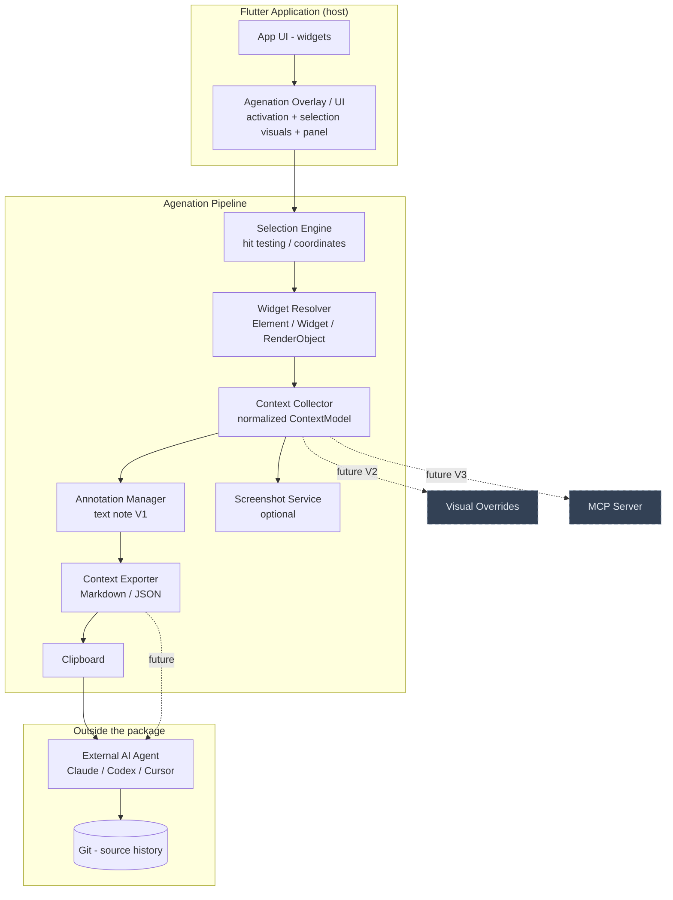
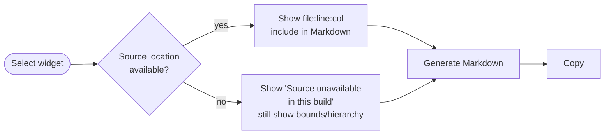
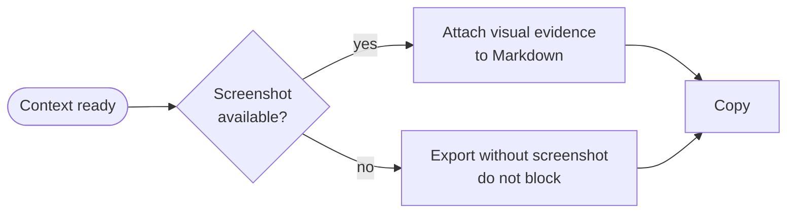
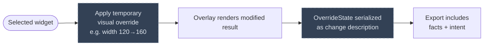
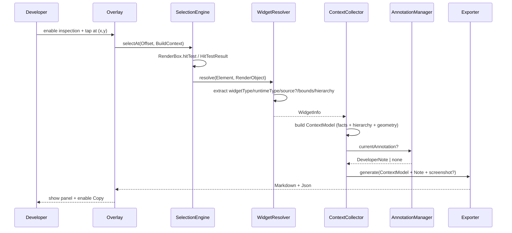
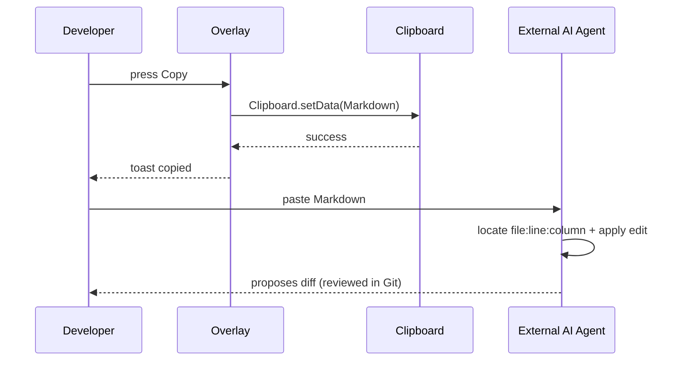
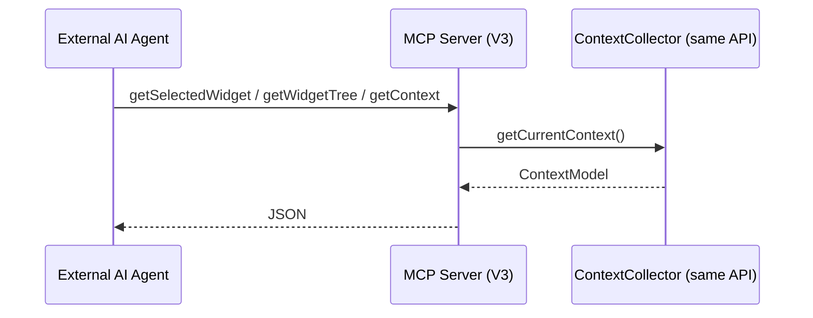

# Flow — Function Call Map & User Flows (Flutter Agentation)

> **Purpose**: The "how it works" file — which functions/widgets call what, user journeys, request/response sequences (inspection → Markdown), screens. **Update whenever** you add/rename/remove a module, widget, controller, service, repository, route, or pipeline step. A stale diagram is worse than no diagram.

---

## Overview

Flutter Agentation is a **local, on-device inspector** embedded in a Flutter app. Developer activates inspection, points at a widget (hit-test), the tool resolves `Element/Widget/RenderObject + source + bounds + hierarchy`, the developer adds a note, and the **Context Exporter** produces deterministic Markdown (and internal JSON) that is copied to the clipboard for an external AI agent. V2 (visual overrides) and V3 (MCP adapter) **share the same ContextModel** — they are not second inspection implementations.

Core loop (V1): **Activate → Select → Inspect → Annotate → Export (Markdown) → Copy → External Agent** — `spec.md:16-33`, `problem-statement.md:48-69`.

---

## Architecture Diagram (pipeline)



Dependency / layer map (`stack-mobile` + `architecture.md:34-38`):

```text
Overlay → SelectionEngine → WidgetResolver → ContextCollector → AnnotationManager → ContextExporter
                                     ↓
                         ContextModel (facts vs intent vs visual)
                             /           \
                        Markdown         MCP adapter (V3)
```

**Invariant**: one ContextModel, two adapters — `architecture.md:83-311`.

---

## User Flows

### Flow: Primary — Inspect and export (V1 happy path)

**Goal**: produce agent-usable context for a visual tweak.

```mermaid
flowchart LR
    A([Developer runs app]) --> B[Activates Agentation]
    B --> C[Taps / points at widget]
    C --> D[Selection overlay appears<br/>bounds highlight]
    D --> E[Panel shows<br/>type / source / bounds / hierarchy]
    E --> F[Developer types feedback<br/>e.g. 'Make more rounded']
    F --> G[Exporter generates Markdown]
    G --> H[Copy to clipboard]
    H --> I[Pastes into external agent chat]
    I --> J[External agent edits source<br/>developer reviews diff]
    style H fill:#0ea5e9,stroke:#0c4a6e,color:#fff
```



### Flow: Source unavailable (graceful degradation)

**Goal**: still useful when file:line is missing.



Per `spec.md:FR-005`, `architecture.md:39-55`, `decision.md:ADR-009`.

### Flow: Screenshot optional



Per `spec.md:FR-009`.

### Flow: V2 deferred (shown for seam only — not implemented)



Not in V1 — see `decisions.md:Decision 005/006`.

---

## Request / Response Flows

### 1. Selection → Context (runtime, synchronous)



### 2. Copy → External agent (out of package)



No network call originates from the package (`spec.md:FR-012`).

### 3. V3 MCP (deferred — same model)



`architecture.md:53-59` — MCP consumes the same internal APIs; no second inspector.

---

## Function Call Map

### Package public surface

```text
lib/agentation.dart (barrel)
  └─ AgentationOverlay.wrap(child: MyApp)
       ├─ AgentationController  (selection state + activation)
       │    ├─ SelectionEngine.selectAt(offset)           (lib/src/selection/)
       │    │    └─ RenderBox.hitTest / BoxHitTestResult
       │    └─ WidgetResolver.resolve(element, renderObject) (lib/src/resolver/)
       │         ├─ SourceResolver.location(element) → SourceLocation?
       │         ├─ BoundsExtractor.rect(renderObject) → Rect?
       │         └─ HierarchyExtractor.path(element) → List<ElementInfo>
       ├─ ContextCollector.collect(selection, note)       (lib/src/context/)
       │    └─ ContextModel {
       │         facts: { widgetType, runtimeType, sourceLocation? (optional),
       │                  bounds, hierarchy, text, key, semantics },
       │         intent: { developerNote },
       │         visual: { /* V2 stub: VisualOverrides */ }
       │       }
       ├─ AnnotationManager.note(value)                   (lib/src/annotation/)
       ├─ MarkdownExporter.export(model) → String         (lib/src/exporter/markdown_exporter.dart)
       │    └─ JsonExporter.toJson(model) → Map (internal / V3)
       └─ Clipboard.copy(markdown)                        (lib/src/exporter/clipboard.dart)
```

Field optionality mirrors `architecture.md:3.3` — many fields `T?`; tests cover both present/absent (`spec.md: acceptance: graceful when source unavailable`).

### Example pipeline with a real widget

```text
Tap at (32, 540) on ElevatedButton
  → SelectionEngine finds Element<ElevatedButton> + RenderParagraph/RenderButton
  → WidgetResolver:
       widgetType: "ElevatedButton"
       source: "lib/screens/home.dart:143:12"  (or null in release)
       bounds: Rect.fromLTWH(32, 540, 320, 52)
       hierarchy: [Scaffold, Column, Card, ElevatedButton]
       text: "Get Started"
  → ContextCollector: ContextModel{ facts: {...}, intent: "Make this more rounded + taller" }
  → MarkdownExporter: deterministic Markdown per spec.md:134-175
  → Clipboard.setData
```

---

## Route / Screen Map

This is **not a routed app** — the tool is an **overlay package**. The host app keeps its own `go_router`/navigation. Agentation adds:

| Surface | Location | Purpose | When visible |
|---------|----------|---------|--------------|
| Activation control | overlay chrome (FAB / edge handle / keyboard shortcut) | Enable/disable inspection | Always (compact) |
| Selection indicator | overlay canvas | Clear boundary around selected widget | Inspection on + selection present |
| Info panel | overlay bottom sheet / side panel | Widget type, source, bounds, hierarchy, runtime properties | Selection present |
| Feedback field | inside info panel | Developer textual note (`spec.md:FR-008`) | Selection present |
| Copy CTA | inside info panel | Copy generated Markdown (`spec.md:FR-011`) | Context ready |
| Visual evidence | inside info panel | Screenshot thumbnail if available (`spec.md:FR-009`) | Optional |

No new app routes are introduced by V1; `flow.md` for navigation is **not applicable**. See `design-statement.md:30-58` for required panel contents.

---

## State Flow (tool UI)

1. **Activation**: `AgenationController.inspectionEnabled: ValueNotifier<bool>` — disables hit handling when `false` (`architecture.md:3.1`).
2. **Selection**: `selectedElement: ValueNotifier<Element?>` set by `SelectionEngine`; `selectedRect: Rect?`.
3. **Resolution**: synchronous derivation — `WidgetInfo` + `SourceLocation?` + `Rect?` + `HierarchyPath`.
4. **Collector**: builds `ContextModel` (immutable) from selection facts + `AnnotationManager.value`.
5. **Exporter**: pure function `ContextModel → Markdown` (no widget); stability tested via golden snapshots.
6. **External**: developer copies → external agent edits source → agent diff reviewed in Git (`decisions.md:Decision 008/011`).

## API / Export Contract

| Artifact | Producer | Consumer | Format |
|----------|----------|----------|--------|
| Markdown | `MarkdownExporter.export(model)` | Clipboard → external agent (human paste) | `spec.md:134-175`, `architecture.md:166-195` — deterministic, agent-stable |
| JSON | `JsonExporter.toJson(model)` | Internal + future MCP (`architecture.md:83-311`) | Same ContextModel, machine-readable |
| Screenshot | `ScreenshotService.capture()` (optional) | Embedded reference in Markdown | `spec.md:FR-009` — must not block selection if unavailable |

---

## Update Protocol (MANDATORY)

Update this file when **any** of the following change:

- [ ] New/renamed/removed module (`overlay`, `selection`, `resolver`, `collector`, `annotation`, `exporter`)
- [ ] Call chain between modules changed
- [ ] New user flow or change to existing (e.g., V2 override step)
- [ ] New agent/MCP method or export field
- [ ] State management choice for overlay controller
- [ ] New platform-specific adapter or behavior

Keep Mermaid diagrams in sync with `lib/src/` — a stale diagram is worse than none.
